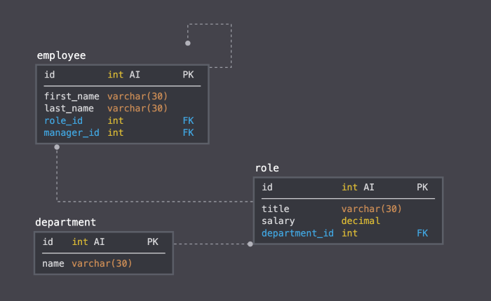

 

## **employee tracker** 
 

[https://github.com/AranATA/employee-tracker](https://github.com/AranATA/employee-tracker) 
 
 

## description

***
This application aims to create a Content Management System (CMS) for managing a company's employees using nodeJS, inquirer, and MySQL. So that a business owner is able to view and manage the departments, roles, and employees in her/his company to organize and plan.
 
 

## acceptance criteria

***

The codebase achieves the following criteria: 

* **department**:

  * **id** - INT PRIMARY KEY
  * **name** - VARCHAR(30) to hold department name

* **role**:

  * **id** - INT PRIMARY KEY
  * **title** -  VARCHAR(30) to hold role title
  * **salary** -  DECIMAL to hold role salary
  * **department_id** -  INT to hold reference to department role belongs to

* **employee**:

  * **id** - INT PRIMARY KEY
  * **first_name** - VARCHAR(30) to hold employee first name
  * **last_name** - VARCHAR(30) to hold employee last name
  * **role_id** - INT to hold reference to role employee has
  * **manager_id** - INT to hold reference to another employee that manages the employee being Created. This field may be null if the employee has no manager
  
Build a command-line application that at a minimum allows the user to:

  * Add departments, roles, employees

  * View departments, roles, employees

  * Update employee roles

Bonus points if you're able to:

  * Update employee managers

  * View employees by manager

  * Delete departments, roles, and employees

  * View the total utilized budget of a department -- ie the combined salaries of all employees in that department

 
 

## usage

***

Under the link below you will find a walkthrough video that demonstrates; how a user would invoke the application from the command line, how a user would enter responses to all of the prompts in the application. 
If the video appears out of focus please hit the space bar twice.

[https://drive.google.com/file/d/1RJl4hiV1N2NAj54aiJzsfiLY-gF4zjpT/view](https://drive.google.com/file/d/1RJl4hiV1N2NAj54aiJzsfiLY-gF4zjpT/view)

Several screenshots that show the different prompts and displayed data: 
 

 

 
 
## some valuable references

***

These notes and links are listing some valuable references among others that I used doing this project: 
 

[https://nodejs.dev/](https://nodejs.dev/)

[https://dev.mysql.com/](https://dev.mysql.com/)

[https://sqlbolt.com/](https://sqlbolt.com/)

[https://www.sqlteaching.com/](https://www.sqlteaching.com/)

[https://www.npmjs.com/package/console.table](https://www.npmjs.com/package/console.table)

[https://shields.io/category/dependencies/](https://shields.io/category/dependencies/)

[https://www.screencastify.com/](https://www.screencastify.com/)

 
 

## credits

***

Stephen Woosley - Bootcamp Instructor 
Patrick Haberern - Bootcamp TA 
Tim Nagorski - Bootcamp TA 
Sean Walmer - Bootcamp TA 
Alexis San Javier - Bootcamp Tutor 
 
 

## license

***

This is an assigment done under a bootcamp program, it is public but please contact the publisher before you use or
change any content. 
ghibli.github@gmail.com
 
 

## badges

***

 
 
